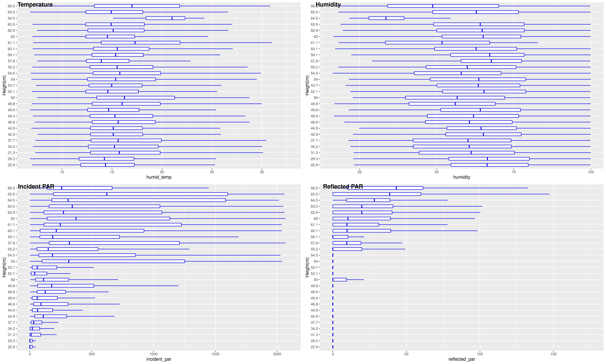

\vspace{-1cm}

```{r setup, include=FALSE}
knitr::opts_chunk$set(echo = FALSE, warning = FALSE, message = FALSE)
library(tidyverse)
library(ggplot2)
library(caret)
library(reshape2)
library(GGally)
library(dplyr)
library(purrr)
library(lubridate) # for working with dates
library(ggplot2)  # for creating graphs
library(scales)   # to access breaks/formatting functions
library(gridExtra) # for arranging plots
library(ggpubr)
```

## 1 Data Collection
### Paper Summary
The purpose of the study is twofold: capture information about a single redwood tree canopy over time and provide a roadmap for future macroscopic studies using a multi-sensor network.

The data was collected in Sonoma, California on a single Redwood tree over a period of days at consistent time intervals during the late spring/early summer.

Based on this study, researchers were able to verify the existence of dynamic spatio-temporal gradients surrounding the tree and prove that complex biological theories can be validated using this measurement framework. Researchers highlighted lesson's learned, beneficial for future studies, highlighting sensor sensitivity based on positioning and yield issues from memory/network constraints.

### How are sensors deployed? 
Nodes (sensor housing) were attached to the body of one redwood tree at various radial, angular, and vertical distances. At  roughly 2-meter spacing intervals the first sensor was placed 15m from ground level and the last sensor at 70m above ground level. The majority of nodes used in the analysis were placed on the west side of the tree about 0.1m - 1m from the tree trunk. Several nodes were placed outside of the measurement envelope to monitor readings in the immediate vicinity.

Nodes had two means of capturing/transferring data: on-site logger stored readings on-device and a separate workflow transferred readings over-the-wire to gateway (make sure this is correct when looking at file).

Sensors were calibrated before being deployed in the field using two trials called roof and chamber. In the roof exercise, nodes were placed in direct view of sunlight atop a building to test the PAR measurements and which were compared to a well known reference. In the chamber phase, temperature and humidity sensors exposed to wide range of conditions: from 5-30 degrees Celsius and between 20-90 %RH. Before being deployed the data harvesting querying was tested in field on a sample tree in similar conditions to verify communication between nodes and on-site internet connected gateway.

### What is the duration of data recording?
Data was recorded over period of almost 44 days from 4/27/2004 5:10pm (epoch 1) to 6/10/2004 2:00pm (epoch 12635). Measurements were taken every 5 minutes and battery operated nodes were duty cycled to conserve power when not operating (on for 4 seconds to take measurements then turned off until next reading). 

### What are the main variables of interest?
Researchers were interested in traditional climate variables temperature, humidity, and light levels which were measured via Photosynthetically Active Radiation (PAR). Light wavelengths between 350nm–700nm were captured in two measurements: incident (direct), which provides information about energy available for photosynthesis, and reflected (ambient), which was used for satellite validation of measurements.

### What is difference between data in two different files?
Data in "sonoma-data-log.csv" represents sensor data saved from the logger to the flash memory on the actual node that was retrieved after the deployment. Data in "sonoma-data-net-csv" is the data retrieved from the wireless network during the deployment.

The main difference between the files is that the scaling/precision on voltage measurements appear different between the two sources. The network file also appears to have some row duplication.


## 2 Data Cleaning
```{r, read-in-data, include=FALSE}
all <- read.csv("sonoma-data-all.csv")
log <- read.csv("sonoma-data-log.csv")
#net <- read.csv("sonoma-data-net.csv")

# metadata files
dates <- read.table("sonoma-dates-formatted", sep=",", header = TRUE)   # losing some precision on epochDays
```


### (a - Relevant Histograms)
```{r, hist-of-variables}
# add data source column indicating file source for direct hist comparison
voltage_log_cutoff = max(log$voltage)
all = all %>%
  mutate(data_source = case_when(
    voltage > voltage_log_cutoff ~ "net",
    voltage <= voltage_log_cutoff ~ "log"
))
rm(log)
```

```{r, network-failure, fig.height = 3, fig.width = 5, fig.align="center"}
# epoch plot showing network failure
ggplot(all, aes(x = epoch, fill = data_source)) +
  geom_histogram(binwidth = 200, color = "gray48") +
  # cosmetics
  labs(x="Epoch", y="Frequency", fill="Data Source", title = "Number of Entries by Epoch and Data Source") +
  scale_fill_brewer(palette="Blues", labels=c("Logger", "Network"))+
  theme(plot.title = element_text(size=11,face="bold"))
```

In Figure 1, the number of measurements recorded during each epoch is plotted for each data source: logger and network. Epoch range and record frequency are not consistent between sources, however, the distribution looks similar over inclusive measurement ranges. The first network measurement occurs on epoch 2812 which corresponds to May 7th, almost 10 days after the experiment started. Tolle et al. cited packet drops and network related issues as a potential culprit to low network yield, but the raw data provided does not match the findings from Figure 7 in the original report. 

```{r, voltage-hist-range-issue, fig.height = 3, fig.width = 5, fig.align="center"}
# voltage plot shows issue with units
ggplot(all, aes(voltage, fill = data_source)) +
  geom_histogram(binwidth = 50, color = "gray48") +
  # cosmetics
  labs(x="Voltage", y="Frequency", fill="Data Source", title = "Voltage Units Differ") +
  scale_fill_brewer(palette="Blues", labels=c("Logger", "Network")) +
  theme(plot.title = element_text(size=11,face="bold"))
```
Voltage units are not consistent across the two sources. Figure 2 illustrates the scaling difference as we see different distributions of voltage based on the data source. Voltage readings from the network source were converted to logger voltage units using the following formula.

$$ Voltage = (0.6)\frac{1024}{V_{network}} $$

Hamatop and hamabot measures had consistent units across data sources, but did not match the scale reported in the Tolle paper. These units were converted to match by multiplying both metrics by a conversion factor 0.0185.

Each record, unique to the data source, has a composite key identifier: nodeid and epoch. During exploratory analysis we identified duplicate entries. Figure 3 displays a distinct count of nodeid/epoch combinations which appear more than once. For example, there are 8,286 affected composite keys from the logger data source that have been duplicated anywhere from two to four times.

```{r, show-net-key-duplicates, fig.height = 3, fig.width = 5, fig.align="center"}
# plot 2 showing number of measurements that have duplicated rows
# summarize(sum(n)) adds the counts together and yields total duplicated rows
all %>% 
  group_by(epoch, nodeid, data_source) %>%
  tally() %>%
  filter(n > 1) %>%
  group_by(data_source) %>% 
  tally() %>%   # summarize(sum(n)) (sums )
  ggplot(aes(x=data_source, y=n, fill = data_source)) +
    geom_bar(stat = "identity", color = "gray48") + 
    geom_text(aes(label=n), position=position_dodge(width=0.9), vjust=5) +
    # cosmetics
    labs(x="Data Source", y="Record Count", title = "Duplicated Entries by Data Source") +
    theme(legend.position = "none") +
    scale_fill_brewer(palette="Blues")+
  theme(plot.title = element_text(size=11,face="bold"))
```

Out of this duplicate record subset how many are unique entries? A unique entry indicates some dimension differs between the duplicated rows and could indicate different measurement readings from the same sensor at the same time.

<!--  -->

```{r, dupe-rows-by-nodeid}
# data frame of the duplicates 
duplicate_entries = all %>% 
                      ungroup() %>%
                      group_by(epoch, nodeid, data_source) %>%
                      tally() %>%
                      filter(n > 1) %>% select(epoch, nodeid, data_source) %>%
                      inner_join(all, by = c("epoch", "nodeid", "data_source"))

# how many are unique entries?
non_dist =  nrow(duplicate_entries) - nrow(distinct(duplicate_entries))
dist = nrow(distinct(duplicate_entries))
count_difference = data.frame(group = c("Non-Distinct", "Distinct"), value = c(non_dist, dist))

```

```{r, pie-chart-dupes, fig.height = 2, fig.width = 6, fig.align="center"}
# plot in pie chart (maybe we could somehow include the overall sample size here)
ggplot(count_difference, aes(x="", y=value, fill=group)) +
  geom_bar(width = 1, stat = "identity") + 
  geom_text(aes(label = value),
            position = position_stack(vjust = 0.5)) +
  coord_polar("y", start=0)  + scale_fill_brewer(palette="Blues")+
  theme_minimal() +
  labs(title = "Number of Duplicated Measurements by Error Type", fill = "Error Type") +
  theme(plot.title = element_text(size=11,face="bold")) +
  theme(axis.title.x=element_blank(),
        axis.text.x=element_blank(),
        axis.ticks.x=element_blank())
```

The pie chart displays the total number of duplicated rows by data source. Distinct refers to rows with different quantities outside of the primary key, while non-distinct means the repeated entries were copied exactly as is. This equates to over 10% of the raw sample! Due to our unfamiliarity with the sensor configuration, lack of detail regarding this problem in the Tolle paper, and large percentage of affected measurements we decided to average the numeric measures from the affected rows and remove any duplicated entries. 

```{r, remove-duplicate-readings}
# take an average across all measures for subset that varies across composite keys.
# (voltage, depth, humidity, humid_temp, humid_adj, hamatop, hamabot)
dupes_dis = distinct(duplicate_entries)

# store the new values in dupe_dis and append it to all
dupe_dis = dupes_dis %>% 
  group_by(epoch, nodeid, data_source) %>% 
  summarize(mean_voltage = mean(voltage), 
            mean_depth = mean(depth),
            mean_humidity = mean(humidity),
            mean_humid_temp = mean(humid_temp),
            mean_humid_adj = mean(humid_adj),
            mean_hamatop = mean(hamatop),
            mean_hamabot = mean(hamabot),
            .groups = 'drop'
            ) %>%
  inner_join(dupes_dis, by = c("epoch", "nodeid", "data_source")) %>%
  select(epoch, nodeid, mean_voltage, mean_depth, mean_humidity, mean_humid_temp, mean_humid_adj, mean_hamatop, mean_hamabot, data_source) %>%
  rename(voltage = mean_voltage,
         depth = mean_depth,
         humidity = mean_humidity,
         humid_temp = mean_humid_temp,
         humid_adj = mean_humid_adj,
         hamatop = mean_hamatop,
         hamabot = mean_hamabot) %>% 
  distinct() %>%
  add_column(result_time = "", .before = "epoch") %>%
  add_column(parent = NA, .before = "voltage")
  

# adjust all...only include single entries
all = all %>% 
    group_by(epoch, nodeid, data_source) %>%
    tally() %>%
    filter(n == 1) %>% select(epoch, nodeid, data_source) %>%
    inner_join(all, by = c("epoch", "nodeid", "data_source"))

# union the new duplicate values
all = union(all, dupe_dis)

# remove unneeded dfs
rm(dupes_dis)
rm(dupe_dis)
```


```{r, unit-conversion}
# PAR unit conversion - hamatop/hamabottom units
par_calibration_factor = 0.0185 # https://edstem.org/us/courses/7965/discussion/571902
all = all %>%
  mutate(incident_par = hamatop * par_calibration_factor,
         reflected_par = hamabot * par_calibration_factor
  )
# set all NAs to 0 
all$incident_par[is.na(all$incident_par)] = 0
all$reflected_par[is.na(all$reflected_par)] = 0

# voltage unit conversion
# 0.6 * (1024/reading)
all = all %>%
  mutate(voltage = case_when(
    #data_source == 'net' ~ voltage / 100,
    data_source == 'net' ~ 0.6*(1024 / voltage),
    TRUE ~ voltage
  ))
```

```{r, remove-voltage-errors}
voltage_removed = all %>%
  filter(voltage > 3 | voltage < 2.4)
all = all %>%
  filter(voltage >= 2.4 & voltage <= 3)
```

### (b - Remove Missing Data)

```{r, remove-na-values}
# rows where one measure is na means all rows are na
na_data = all %>% filter(is.na(humid_temp) | is.na(humidity) | is.na(hamatop) | is.na(hamabot))
all = all %>% drop_na(humid_temp) %>% drop_na(humidity) %>% drop_na(hamatop) %>% drop_na(hamabot)
```

```{r, create-holistic-view}
# one measurement per composite key...take average of numeric columns
initial_all_df = all
# take the average for the numeric columns doesn't matter for single entries b/c the average will just be the same value
all = all %>%
  ungroup() %>%
  group_by(nodeid, epoch) %>%
  summarize(mean_voltage = mean(voltage), 
           mean_depth = mean(depth),
           mean_humidity = mean(humidity),
           mean_humid_temp = mean(humid_temp),
           mean_humid_adj = mean(humid_adj),
           mean_hamatop = mean(hamatop),
           mean_hamabot = mean(hamabot),
           mean_incident_par = mean(incident_par),
           mean_reflected_par = mean(reflected_par),
           .groups = 'drop') %>%
  rename(voltage = mean_voltage,
         depth = mean_depth,
         humidity = mean_humidity,
         humid_temp = mean_humid_temp,
         humid_adj = mean_humid_adj,
         hamatop = mean_hamatop,
         hamabot = mean_hamabot,
         incident_par = mean_incident_par,
         reflected_par = mean_reflected_par)
```

```{r, get-good-date-column}
# update result time with accurate values from the metadata file.
voltage_removed = voltage_removed %>% 
  ungroup() %>%
  inner_join(dates, by = c("epoch" = "epochNums")) %>%
  #select(-result_time) %>%
  relocate(epochDates, epochDays)

# split up the new date field by space...want to keep the time
voltage_removed = voltage_removed %>%
  separate(epochDates, into = c('weekday', 'month', 'day', 'time', 'year'),
           sep = " +")

all = all %>% 
  ungroup() %>%
  inner_join(dates, by = c("epoch" = "epochNums")) %>%
  #select(-result_time) %>%
  relocate(epochDates, epochDays)

# split up the new date field by space...want to keep the time
all = all %>%
  separate(epochDates, into = c('weekday', 'month', 'day', 'time', 'year'),
           sep = " +")
```

There where several data removal steps we took to ensure the best analysis. The table shows data processing steps and corresponding record counts after completion. First, duplicates were averaged and removed as mentioned above. We replicated the voltage filter step outlined in Tolle paper, entries with voltage greater than 3V or less than 2.4V were removed. Numerous entries with completely missing measurement across all dimensions were also removed. In order to create a holistic dataset encompassing the maximum amount of time, records from both data sources were combined into a unified view. Numerical measures were averaged for composite keys present in both network and logger files. Lastly, we visually identified some outliers that were removed. More on this step will be discussed later.

**Data Removal Step**    **Record Count**   **Net Change**
---------------------   -----------------   --------------
Ingestion               416,036             0
Duplicate Removal       393,213             -22,823
Voltage Removal         351,914             -41,299
Drop NAs                341,659             -10,255
Holistic View           277,241             -64,418
Outlier Removal         264,932             -12,309
------------------      -----------------   --------------

```{r, distibution-of-missing-measurements}
total_missing_data = union(duplicate_entries, na_data %>% select(-incident_par, -reflected_par), voltage_removed %>% select(epoch, nodeid, data_source, result_time, parent, voltage, depth, humidity, humid_temp, humid_adj, hamatop, hamabot))
total_missing_data = total_missing_data %>% 
  ungroup() %>%
  inner_join(dates, by = c("epoch" = "epochNums")) %>%
  relocate(epochDates, epochDays)
total_missing_data = total_missing_data %>%
  separate(epochDates, into = c('weekday', 'month', 'day', 'time', 'year'),
           sep = " +")

# what time of day did missing measures occur
# ggplot(total_missing_data, aes(time)) +
#     geom_bar(aes(fill = data_source)) +
#     scale_fill_brewer(palette="Blues", labels=c("Logger", "Network")) +
#     labs(main = "Time of Day - Missing Measurements", x = "Time of Day", fill = "Data Source")

# what day did missing measures occur
total_missing_data$date_concat = 
  as.Date(paste(total_missing_data$year, total_missing_data$month, total_missing_data$day), "%Y %b %d")
```


```{r, missing-data-plot-by-day, fig.height = 3, fig.width = 5, fig.align="center"}
ggplot(total_missing_data, aes(date_concat)) +
    geom_bar(aes(fill = data_source), color = "gray48") +
    scale_fill_brewer(palette="Blues", labels=c("Logger", "Network"))+
    ggtitle("Missing Measurements by Day") +
    labs(fill = "Data Source", x = "Day") +
    scale_x_date(breaks = scales::breaks_pretty(13))+
  theme(plot.title = element_text(size=11,face="bold"))
#grid.arrange(plot1, plot2, ncol=2)
```

```{r}
# clean up
rm(duplicate_entries)
rm(na_data)
rm(voltage_removed)
rm(total_missing_data)
```

The time of day for the missing measurements appear uniform across 24-hours. Over the course of the experiment, we see more measurement issues than at the beginning. This echos the sentiment expressed in the Tolle report.


### (c - Incorporate Location Data)
After we joined the location data, we have 15 variables.
```{r, incorporate-location-data}
locations <- read.table(file = "mote-location-data.txt", header = TRUE, sep = ",")
colnames(locations)[1] = "nodeid"

all = left_join(all, locations, by="nodeid")
```


### (d - Visually Identify Outliers)
Tolle mentioned outlier related issues corresponding to humidity measurements where %humidity was greater than 100%. We observed a similar problem in our dataset. Visually inspecting the histogram we see a number of readings over 100% threshold, which were excluded from analysis. Visually inspecting temperature plots, we saw a large number of outliers. A quick google search for the hottest recorded temperature in Sonoma, CA revealed 44 degrees Celsius, much lower than the 100+ degree points indicated on the plots. Tolle's max temperature reading was 32.6 degrees and because we are unfamilar with the climate in the geographic region we decided to use this as our cutoff filter. All measurements greater than 32.6 were removed. The incident par histogram shows a long tail distribution. In the boxplot we see two distinct groups of outliers separated by almost 1000 units. We determined to remove the second group by enforcing a manual cutoff of < 2500 because it seemed to represent sensor failure due to the low number of points.

```{r, facet-hist-plots-outliers, fig.height = 5, fig.width = 5, fig.align="center"}
# raw histograms
# all %>%
#  ungroup() %>%
#  select(humidity, humid_temp, incident_par, reflected_par, .group = ) %>%
#  keep(is.numeric) %>%
#  gather() %>%
#  ggplot(aes(value)) +
#    facet_wrap(~ key, scales = "free") +
#    geom_histogram()
```

```{r}
# remove readings with humidity > 100%
#boxplot(all$humidity, main = "Humidity - Original", ylab = "% Humidity")
all = all %>% filter(humidity <= 100)
#boxplot(all$humidity, main = "Humidity - Outliers Removed", ylab = "% Humidity")
```


```{r, identify-outliers, fig.height = 4, fig.width = 8, fig.align="center"}
# try with layout
par(mfrow = c(1,2))

# remove measurements based on temperature cutoff
#boxplot(all$humid_temp, main = "Temp. - Original", ylab = "\u00B0C")
all = all %>% filter(humid_temp <= 32.6)
#boxplot(all$humid_temp, main = "Temp. - Outliers Removed", ylab = "\u00B0C")

# remove incident par outliers
par(cex.main=0.75)
boxplot(all$incident_par, main = "Incident PAR - Original")
all = all %>% filter(incident_par < 2500)
boxplot(all$incident_par, main = "Incident PAR - Outliers Removed")
par(mfrow = c(1,1))
```

### (e - Additional Outliers)
As we noted above, we found a large number of duplicate entries from both measurement sources. These duplicated entries were removed to prevent over-weighting with additional measures. The incident PAR boxplot indicates a large number of potential outliers even after initial cut-off filtering. However, we decided to include them in analysis because we believed the nighttime 0 PAR readings were skewing quantiles closer towards 0. We also are not familiar with the flux units on PAR dimensions which contributed to inclusion of remaining points.


## 3 Data Exploration
### (a - Pairwise Scatter)
For pairwise analysis we decided to look at two distinct time periods, sunrise and sunset, as we believed they presented the most dynamic conditions to explore potential correlations. Would trends observed during one time period also manifest during the other? Researching sunrise and sunset times in Sonoma, CA during the months of the study lead us to select 5-hour intervals encompassing both astrological events. Sunrise: 5:00am - 10:00am and Sunset: 4:00pm - 9:00pm

<!-- **Astrological Event**    **Start Time**      **End Time** -->
<!-- ---------------------     --------------      -------------- -->
<!-- Sunrise                   5:00am              10:00am            -->
<!-- Sunset                    4:00pm              9:00pm -->
<!-- ---------------------     --------------      -------------- -->

```{r, pairwise-scatterplots}
# grab distinct time intervals
sunrise = all %>% filter(time >= "05:00" & time <= "10")
sunset = all %>% filter(time >= "16" & time <= "21")
```

```{r, correlation-plots-different-time-periods, fig.height = 2, fig.width = 5, fig.align="center"}
# ggcorr(all[c("humidity","humid_temp","incident_par", "reflected_par")], method = c("everything", "pearson")) +
#   labs(title = "Correlation Map - All Time Periods")
plot1 = ggcorr(sunrise[c("humidity","humid_temp","incident_par", "reflected_par")],hjust = 0.65, size = 2.5,
               method = c("everything", "pearson")) +
  labs(title = "Sunrise") + theme(legend.position = "none") +
  theme(plot.title = element_text(size=10,face="bold"))

plot2 = ggcorr(sunset[c("humidity","humid_temp","incident_par", "reflected_par")], hjust = 0.65, size = 2.5,
               method = c("everything", "pearson")) +
  labs(title = "Sunset") + theme(legend.position = "none") +
  theme(plot.title = element_text(size=10,face="bold"))
grid.arrange(plot1, plot2, ncol=2)
```


```{r, humidity-temp-scatter, fig.height = 3, fig.width = 7, fig.align="center"}
###########  Humidity vs. Temp
plot1 = ggplot(sunrise, aes(x=humid_temp, y=humidity) ) +
  geom_point() +
  ggtitle("Sunrise") +  theme(plot.title = element_text(hjust = 0.5)) +
  labs(x = "Temperature (\u00B0C)", y = "% Humidity") +
  theme(plot.title = element_text(size=11,face="bold"))

plot2 = ggplot(sunset, aes(x=humid_temp, y=humidity) ) +
  geom_point() +
  ggtitle("Sunset") +  theme(plot.title = element_text(hjust = 0.5)) +
  labs(x = "Temperature (\u00B0C)", y = "% Humidity") +
  theme(plot.title = element_text(size=11,face="bold"))
grid.arrange(plot1, plot2, ncol=2)
########### 
```

```{r, temp-incident-par-scatter, fig.height = 3, fig.width = 7, fig.align="center"}
###########  Temp vs. Incident PAR
# plot1 = ggplot(sunrise, aes(x=incident_par, y=humid_temp) ) +
#   geom_point() + theme(plot.title = element_text(hjust = 0.5)) +
#   ggtitle("Sunrise") + labs(x= "Incident PAR (mol/m"^"2"~"/s)", y = "Temperature (\u00B0C)") +
#   theme(plot.title = element_text(size=11,face="bold"))
# 
# plot2 = ggplot(sunset, aes(x=incident_par, y=humid_temp) ) +
#   geom_point() + theme(plot.title = element_text(hjust = 0.5)) +
#   ggtitle("Sunset") + labs(x= "Incident PAR (mol/m"^"2"~"/s)", y = "Temperature (\u00B0C)") +
#   theme(plot.title = element_text(size=11,face="bold"))
# grid.arrange(plot1, plot2, ncol=2)
########### 
```

```{r, humid-incident-par-scatter, fig.height = 3, fig.width = 7, fig.align="center"}
###########  Humidity vs. Incident PAR
# plot1 = ggplot(sunrise, aes(x=incident_par, y=humidity) ) +
#   geom_point() + theme(plot.title = element_text(hjust = 0.5)) +
#   ggtitle("Sunrise") + labs(x= "Incident PAR (mol/m"^"2"~"/s)", y = "% Humidity") +
#   theme(plot.title = element_text(size=11,face="bold"))
# 
# plot2 = ggplot(sunset, aes(x=incident_par, y=humidity) ) +
#   geom_point() + theme(plot.title = element_text(hjust = 0.5)) +
#   ggtitle("Sunset") + labs(x= "Incident PAR (mol/m"^"2"~"/s)", y = "% Humidity") +
#   theme(plot.title = element_text(size=11,face="bold"))
# grid.arrange(plot1, plot2, ncol=2)
###########
```

```{r}
# see appendix code for extra charts
rm(sunrise)
rm(sunset)
```


Many interesting pairwise scatter plots were analyzed for trends. We highlight interesting findings below.

#### Describe findings from the charts.
Humidity vs. temperature plot reveals a relationship between the two variables as many of the points look clustered together. We see that as temperature increases, humidity decreases. This trend appears linear during sunrise, but appears exponential/polynomial during sunset.

Correlation plots were created for each of the measured values which can be viewed as proxies for scatter plot relationships. Highlights from these figures include a strong positive correlation between incident and reflected PAR and a negative correlation between humidity and temperature. All correlations appear magnified (daker colors) during sunset indicating strong relationships.

### (b - Incident PAR Association)
Temperature appears to be good predictor of incident PAR. We saw positive correlations between the two variables during both time frames. Humidity displayed a negative correlation with incident PAR which is more pronounced during sunset.

### (c - Time Series)
The four measured dimensions were plotted over time. To make the plots easier to comprehend the sensor heights where grouped into 10 meter interval height classes. Our analysis of each plot follows.

```{r, time-series-conversions}
# convert day
all$date_concat =
  as.Date(paste(all$year, all$month, all$day), "%Y %b %d")

all$date_concat = as.POSIXct(paste(all$date_concat, all$time))

# try and bin heights (looking at distinct)
all = all %>% 
  mutate(height_class = case_when(
   Height <= 20 ~ "10 - 20 m",
   Height > 20 & Height <= 30 ~ "20 - 30 m",
   Height > 30 & Height <= 40 ~ "30 - 40 m",
   Height > 40 & Height <= 50 ~ "40 - 50 m",
   Height > 50 & Height <= 60 ~ "50 - 60 m",
   Height > 60  ~ "60+ m"))
```

```{r, temp-timeseries-plot}
# Temperature
plot1 = ggplot(all %>% na.omit(Height), aes(x = date_concat, y = humid_temp, colour = height_class)) +
    geom_line() +
    ggtitle("Temperature vs. Time") + labs(x = "Day", y = "Temperature (\u00B0C)") +
    scale_x_datetime(breaks = scales::breaks_pretty(13)) +
  theme(plot.title = element_text(size=11,face="bold"))
```

```{r, humidity-time-series-plot}
# Humidity
plot2 = ggplot(all %>% na.omit(Height), aes(x = date_concat, y = humidity, colour = height_class)) +
    geom_line() +
    ggtitle("Humidity vs. Time") +  labs(x = "Day", y = "% Humidity") +
    scale_x_datetime(breaks = scales::breaks_pretty(13))+
  theme(plot.title = element_text(size=11,face="bold"))
```

```{r, incident-par-timeseries-plot}
# Incident PAR
plot3 = ggplot(all %>% na.omit(Height), aes(x = date_concat, y = incident_par, colour = height_class)) +
    geom_line() +
    ggtitle("Incident PAR vs. Time") +  labs(x = "Day", y = "Incident PAR (mol/m"^"2"~"/s)") +
    scale_x_datetime(breaks = scales::breaks_pretty(13))+
  theme(plot.title = element_text(size=11,face="bold"))
```

```{r, reflected-par-timeseries-plot}
# Reflected PAR
plot4 = ggplot(all %>% na.omit(Height), aes(x = date_concat, y = reflected_par, colour = height_class)) +
    geom_line() +
    ggtitle("Reflected PAR vs. Time") +  labs(x = "Day", y = "Reflected PAR (mol/m"^"2"~"/s)") +
    scale_x_datetime(breaks = scales::breaks_pretty(13))+
  theme(plot.title = element_text(size=11,face="bold"))
```

#### Temperature vs. Time
We artificially removed high temperature readings discussed earlier. We see a range of 6.78 - 32.6 degrees Celsius respectively.

There are some interesting trends in the temporal domain. All height sensors track the same general shape, but experience slight differences based on height that may indicate a relationship worth investigating. The high temperatures were almost exclusively acheived in the evenings (May 2nd/14th) by sensors mounter higher than 30m. This pattern is not consistent with the low temperature readings.

One interesting empirical note, we wee a local temperature max around May 31st that may indicate some meteorological event (heat wave, cold front, etc.) during the time period which could be interesting to focus future analysis on.

#### Humidity vs. Time
Humidity readings were artificially capped at 0% and 100% respectively. We see a range of 16.3% - 100% over the duration of collection. All sensors tracked the same general trend irrespective of sensor height which indicates no or weak relationship between height and humidity. One interesting thing manifested in this chart is around May 31st where we see humdity drop to a local min before increasing back up. This corresponds with the temperature increase we observed over the same temporal domain.

```{r, smoosh-time-plots-work,  fig.height = 7, fig.width = 9, fig.align="center"}
#grid.arrange(plot1, plot2, plot3, plot4, ncol=2)
ggarrange(plot1, plot2, plot3, plot4, ncol=2, nrow=2, common.legend = TRUE, legend="bottom")
```

#### Incident PAR vs. Time
We see range of 0 and 2146 over duration of collection. Sensors mounted the highest often achieved the highest reading each day. The peaks and valleys represent the day and night distinction, with peaks during the day and valleys at night. On May 26th the chart experiences a much lower local max of ~800 when compared with the other days which might indicate some sort of sun blocking event (cloud cover, storm, etc.).

#### Reflected PAR vs. Time
We see range of 0 - 175 over duration of collection. We see most of the daily high readings correspond to the tallest mounted sensors and most of the daily lows with the lowest mounted sensors. One interesting observation from this plot is specific to the daily maximum's: there is much greater variability in this metric than seen in the incident PAR plot. Several days recorded max values that are much lower. One reading corresponds with the cloudy day (May 26th) noted in the incident PAR chart, but there are several other days which are interesting and may be worth investigating.

### (d - PCA Analysis & Scree Plot)
PCA was performed on the following dimensions: humidity, temperature, incident PAR, reflected PAR, and height. The Scree Plot shows the first three components explain almost 90% of the variability in the data and indicates a lower dimensional representation is possible. We discuss the lower dimension representation in interesting finding 1.

```{r, pca}
# perform pca
pr_comp = prcomp(all %>% na.omit(Height) %>% ungroup() %>% select(humidity, humid_temp, incident_par, reflected_par, Height), center = TRUE, scale. = TRUE)
#summary(pr_comp)
#pr_comp

# scree plot
eig_values = (pr_comp$sdev)^2 
eigs_cum <- cumsum(eig_values) /sum(eig_values)
```

```{r, screeplot, fig.height = 2, fig.width = 5, fig.align="center"}
ggplot() + geom_point(aes(x = 1:length(eig_values), y=eigs_cum)) +
  labs(x = "PC Number (in order of eigenvalue size)", y = "Fraction of Total Variance") +
  ggtitle("Five Dimension Scree Plot") +
  theme(plot.title = element_text(size=11,face="bold"))
```

## 4 Interesting Findings

### Finding 1 - Lower Dimensional Height Dispersion

Are measurements recorded at different heights distinguishable?
```{r}
# project points onto PCAs
scores = pr_comp$x   # score vectors
df = data.frame(PC1 = scores[,1], PC2 = scores[,2], nodeid = all %>% na.omit(Height) %>% select(height_class))
```
```{r, lower-dim-representation, fig.height = 3, fig.width = 5, fig.align="center"}
ggplot(df, aes(PC1, PC2)) +
  geom_point(size=0.75, aes(colour = height_class), alpha = 0.8) +
  scale_color_brewer(palette="Paired") +
  guides(colour = guide_legend(override.aes = list(size=5))) +
  ggtitle("Lower Dimension Representation - First Two PCs") +
  theme(plot.title = element_text(size=11,face="bold"))
```
```{r}
rm(df)
```

Here the first two principal component score vectors were plotted for each of the height classes. What's interesting is we see tight groupings for sensors mounted below 30 m and much more variability as measurements are recorded at higher elevations. We initial suspected this variability was due the sample size recorded at each height, with more samples recorded at higher levels becuase of more sensors. However, looking at the table we see the most measurements in the 40-50 meter height range, but much more variability in the 60+ meter class. Intuitively we suspect that the top of the tree presents a harsher environment that is more exposed to weather patterns than the base that is more densely protected by foliage. This explanation could explain the wide dispersion of points at heigher measurement levels.


**NA**    **10 - 20 m**    **20 - 30 m**    **30 - 40 m**    **40 - 50 m**    **50 - 60 m**    **60+ m**
------    -------------    -------------    -------------    -------------    -------------    ---------
2,201     2,638            32,633           29,644           82,201           64,121           51,494
------    -------------    -------------    -------------    -------------    -------------    ---------

 
### Finding 2 - Reflected PAR Max Reading Variability

Does the time of day determine the max reflected PAR?
```{r, height-inspection}
mx_reflected_par_pts = all %>% na.omit(Height) %>% ungroup() %>% group_by(month, weekday, day) %>% summarize(max(reflected_par)) %>% rename("reflected_par" = "max(reflected_par)") %>%
  inner_join(all)

# add time classification
mx_reflected_par_pts = mx_reflected_par_pts %>% 
  mutate(timeboundary = case_when(time >= "16:00:00" & time <= "17:00:00" ~ TRUE, TRUE ~ FALSE))
```

```{r, fig.height = 3, fig.width = 9, fig.align="center"}
plot1 = ggplot(mx_reflected_par_pts, aes(date_concat, reflected_par, color = timeboundary)) + 
  geom_point() + 
  labs(title = "Maximum Reflected PAR", x = "Day", y = "Reflected PAR (mol/m"^"2"~"/s)", color = "Time Within 16:00 - 17:00") +
  geom_hline(yintercept = mean(mx_reflected_par_pts$reflected_par), color="blue") +
  theme(plot.title = element_text(size=11,face="bold"))


# histogram of the reflected par max readings
dtTime = data.frame(tm = as.numeric(mx_reflected_par_pts$date_concat - trunc(mx_reflected_par_pts$date_concat, "days")))
dtTime$cond = dtTime$tm >= "16:00:00" & dtTime$tm <= "17:00:00"
plot2 = ggplot(dtTime, aes(tm, fill = cond)) +
  geom_histogram() +
  labs(x = "Hour of Day", y = "Frequency") +
  ggtitle("Maximum Reflected PAR Time Histogram") +
  theme(plot.title = element_text(size=11,face="bold")) +
  guides(fill=guide_legend(title="Time Within 16:00 - 17:00"))

ggarrange(plot1, plot2, ncol=2, nrow=1, common.legend = TRUE, legend="bottom")
# 
# hist(dtTime, main = "Max Reflected PAR Hist", xlab = "Hour of Day")
```

We noticed in the reflected PAR time series plots the maximum reading varied across days more relative to incident PAR readings. The scatter plot shows the maximum reading by day with a blue line representing the average max value. Notice the large amount of variability. We wanted to know if the distribution of the hour of the day, corresponding to the sun height, was centered around a specific time/max value. The histogram shows that around the evening hour we get most of our maximum measurements. Tolle mentioned the PAR sensors were incredible sensitive to changes in light angles and we believe that this finding proves that thought. We would expect the reflected PAR max trend to be similar to the incident PAR, but we believe the difference could be explain by cloud cover between hours 16:00 - 17:00 which is why we see this wide dispersion in the histogram.

### Finding 3
How much does the humidity and temperature vary with height during the day?
```{r, interesting-finding-3 - DL, include = FALSE}
# try from 6:00 to 20:00
day_time = all %>%
  filter(time >= "06" & time <= "20")
# As the paper did, filter Height <= 22.8
day_time_for_box_plots_paper = day_time %>% arrange(Height) %>% filter(Height >= 22.8)

day_time_for_box_plots_paper = day_time_for_box_plots_paper %>% 
  na.omit() %>%
  mutate(height_class = case_when(
   Height <= 20 ~ "10 - 20m",
   Height > 20 & Height <= 30 ~ "20 - 30 m",
   Height > 30 & Height <= 40 ~ "30 - 40 m",
   Height > 40 & Height <= 50 ~ "40 - 50 m",
   Height > 50 & Height <= 60 ~ "50 - 60 m",
   Height > 60  ~ "60+ m"))

# temperature
temp_class = ggplot(day_time_for_box_plots_paper, aes(x=humid_temp, y=height_class, group = height_class)) + 
    geom_boxplot(color = "blue", outlier.shape = NA,width = 0.5,position = "dodge") + labs(x = "Temperature", y = "Height Class (m)")
 

humid_class = ggplot(day_time_for_box_plots_paper, aes(x=humidity, y=height_class, group = height_class),) + 
    geom_boxplot(color = "blue", outlier.shape = NA,width = 0.5,position = "dodge") + labs(x = "Temperature", y = "Height Class (m)")
```

```{r,fig.height = 3, fig.width = 10, fig.align="center", include = FALSE}
jpeg("q4-interesting findings-3.jpeg", width = 6, height = 4, units = 'in', res = 300)
# humidity
ggarrange(temp_class, humid_class,
                   labels = c("Temperature", "Humidity"),
                   ncol = 2, nrow = 1)
dev.off
```


Our hypothesis is that the temperature measured should be lower at the bottom of the red wood during day time and it should have a positive relationship with height. The humidity measured would be vice versa and have a negative relationship with height. The explanation is that the top of the red wood receives a larger amount of incident PAR and reflective PAR, and therefore has more energy and higher temperatures. Correspondingly, The higher the temperature, the faster the water vapors, which leads to a lower humidity. The stacked box plot based on height during day time (6am-8pm) confirms our hypothesis. The 20-30 m range shows lower mean temperature and higher mean humidity. However it is interesting to notice that except in the 20-30 m range, the temperature does not vary significantly in the 30-60m range. The linear relationship we assume is not supported by our data. Our findings correspond to the findings of Tolle (Tolle,2005). The stacked box plot from Tolle shows that the middle part of the red wood has a comparative consistent temperature through out the day and night. In conclusion, we suppose that red woods have a spacial homeostasis mechanism that regulates its temperature and humidity in the middle. It would be an interesting research topic to find out the working principle of this homeostasis.
>>>>>>> a63626a98e5d668593dc92c320ec3a58e985bf9d

## 5 Graph Critique in the Paper
### (a - Log Transform of Histograms)
The incident and reflected PAR histograms from Tolle et al. (figure 3a) have long tails and with large numbers of observations around 0 which make the charts hard to discern. We present this data after taking a log transform of the observations and present the results side-by-side with the initial chart versions (non-log scale). 
```{r, 5a-incident-charts}
# incident PAR charts
# need to account for the 0s...add small positive number

# Original Chart - No Log Transform
# plot1 = ggplot(all, aes(x = incident_par)) +
#   geom_histogram(fill = "blue4", color = "white", 
#                  aes(y = (..count..)/sum(..count..)), binwidth = 250) +
#   scale_y_continuous(labels = scales::percent_format(), n.breaks = 10) +
#   labs(title = 'Incident PAR - Original Scale') +
#   xlab(expression('micromol/m'^2*'/s')) + 
#   ylab("Percentage of Readings") +
#   theme(plot.title = element_text(size=11,face="bold"))

```
```{r arrange-five-charts, fig.height = 2, fig.width = 5, fig.align="center"}
# Log Transform
ggplot(all, aes(x = log(incident_par + 0.001))) +
  geom_histogram(aes(y = (..count..)/sum(..count..)), binwidth = .5) +
  scale_y_continuous(labels = scales::percent_format()) +
  labs(title = 'Incident PAR - Log Scale') +
  xlab(expression('Log Incident PAR')) + 
  ylab("Percentage of Readings") +
  theme(plot.title = element_text(size=11,face="bold"))
```

Both log charts visually convey the long tail better than the non-log counter-parts. In fact, the log scale displays a bimodal distribution that could be interpreted sunlight differences between day/night. Some readers might be mislead/confused by the log interpretation. At first glance, PAR measurements appear more concentrated around a smaller range and it's important readers understand the log function before reaching an incorrect conclusion derived from the plots. We've displayed both versions for clarity.

```{r, 5a-reflected-charts}
# reflected PAR
# Original Chart - No Log Transform
# plot1 = ggplot(all, aes(x = reflected_par)) +
#   geom_histogram(fill = "blue4", color = "white", 
#                  aes(y = (..count..)/sum(..count..)), binwidth = 25) +
#   scale_y_continuous(labels = scales::percent_format(), n.breaks = 10) +
#   labs(title = 'Reflected PAR - Original Scale') +
#   xlab(expression('micromol/m'^2*'/s')) + 
#   ylab("Percentage of Readings") + 
#   theme(plot.title = element_text(size=11,face="bold"))
```

```{r, reflected-charts-join, fig.height = 2, fig.width = 5, fig.align="center"}
# Log Transform
ggplot(all, aes(x = log(reflected_par + 0.001))) +
  geom_histogram(aes(y = (..count..)/sum(..count..)), binwidth = 0.8) +
  scale_y_continuous(labels = scales::percent_format()) +
  labs(title = 'Reflected PAR - Log Scale') +
  xlab(expression('Log Reflected PAR')) + 
  ylab("Percentage of Readings") +
  theme(plot.title = element_text(size=11,face="bold"))
```


### (b - Boxplot Analysis)



The boxplots from Figure 3[c] in the original paper are showing how the sensor measurements vary over the height of the tree. Tolle et al. are attempting to look for spatial gradients and trends by eliminating the temporal aspect of the data.

With regards to the PAR charts I don't believe these plots convey the right message. I think the author should have split up the temporal ranges included in this chart. For example, the PAR temporal range should only include daytime, when the sun is shining. Including the full temporal range adds a large number of data points with 0 light readings and effectively pulls the mass closer to zero for all readings and makes the gradient less pronounced.

We plotted the charts only considering daylight hours. With the data stratified by day, the gradients in incident/reflected PAR become much more clear.

```{r,q5b-height-value-box-plots}
# try from 6:00 to 20:00
# day_time = all %>%
#   filter(time >= "06" & time <= "20")
# 
# # convert height to be a factor and filter out Height <=22.8 to make our figure looks better
# day_time_for_box_plots = day_time %>%
#   filter(Height >=22.8) %>% arrange(Height) %>% mutate(Height = as.factor(Height))
# 
# #Create Height labels for plotting
# Height_character = as.character(unique(factor(day_time_for_box_plots$Height)))
# Height_factor = unique(factor(day_time_for_box_plots$Height))
# Height_numeric = as.numeric(Height_factor)
# 
# # fix formatting for incident par boxplot and implement change for other dimensions (match paper)
# par(mfrow=c(1,4))
# 
# # temperature
# temp = ggplot(day_time_for_box_plots, aes(x=humid_temp, y=Height, group = Height),) + 
#     geom_boxplot(color = "blue", outlier.shape = NA,width = 0.5,position = "dodge") + 
#     scale_y_discrete("Height(m)",breaks= Height_numeric)
# 
# # humidity
# humid = ggplot(day_time_for_box_plots, aes(x=humidity, y=Height, group = Height),) + 
#     geom_boxplot(color = "blue", outlier.shape = NA,width = 0.5,position = "dodge") + 
#     scale_y_discrete("Height(m)",breaks= Height_numeric)
# 
# # incident par
# incident = ggplot(day_time_for_box_plots, aes(x=incident_par, y=Height, group = Height),) + 
#     geom_boxplot(color = "blue", outlier.shape = NA,width = 0.5,position = "dodge") + 
#     scale_y_discrete("Height(m)",breaks= Height_numeric)
# 
# # reflected par
# reflected = ggplot(day_time_for_box_plots, aes(x=reflected_par, y=Height, group = Height),) + 
#     geom_boxplot(color = "blue", outlier.shape = NA,width = 0.5,position = "dodge") + 
#     scale_y_discrete("Height(m)",breaks= Height_numeric)
# 
# jpeg("q5b-height-value-box-plots.jpeg", width = 20, height = 12, units = 'in', res = 300)
# ggarrange(temp, humid, incident, reflected,
#                     labels = c("Temperature", "Humidity", "Incident PAR", "Reflected PAR"),
#                     ncol = 2, nrow = 2)
# dev.off

#Create high resolution jpeg images
#jpeg("q5b-height-value-box-plots.jpeg", width = 12, height = 8, units = 'in', res = 300)
#dev.off
```

```{r,q5b-height-value-box-plots-DL-2}
#Use the height from paper 
# Height_from_paper = c(22.9, 29.3, 31.3, 34.2, 37.7, 42.9, 44.9, 46.6, 49.4, 49.6, 49.8, 50, 52.1, 53.7, 54, 54.5, 55.2, 57.8, 59.1, 60.1, 61.1, 62, 62.9, 63.5, 64.5, 65.5, 66.5)
# 
# day_time_for_box_plots_paper = day_time %>%
#   filter(Height %in% Height_from_paper) %>% arrange(Height) %>% mutate(Height = as.factor(Height))
# 
# #Create Height labels for plotting
# Height_character = as.character(unique(factor(Height_from_paper)))
# Height_numeric = as.numeric(Height_factor)
# 
# # fix formatting for incident par boxplot and implement change for other dimensions (match paper)
# par(mfrow=c(1,4))
# 
# # temperature
# temp = ggplot(day_time_for_box_plots_paper, aes(x=humid_temp, y=Height, group = Height)) + 
#     geom_boxplot(color = "blue", outlier.shape = NA,width = 0.5,position = "dodge") + 
#     scale_y_discrete("Height(m)",breaks= Height_from_paper)
# 
# # humidity
# humid = ggplot(day_time_for_box_plots_paper, aes(x=humidity, y=Height, group = Height),) + 
#     geom_boxplot(color = "blue", outlier.shape = NA,width = 0.5,position = "dodge") + 
#     scale_y_discrete("Height(m)",breaks= Height_from_paper)
# 
# # incident par
# incident = ggplot(day_time_for_box_plots_paper, aes(x=incident_par, y=Height, group = Height),) + 
#     geom_boxplot(color = "blue", outlier.shape = NA,width = 0.5,position = "dodge") + 
#     scale_y_discrete("Height(m)",breaks= Height_from_paper)
# 
# # reflected par
# reflected = ggplot(day_time_for_box_plots_paper, aes(x=reflected_par, y=Height, group = Height),) + 
#     geom_boxplot(color = "blue", outlier.shape = NA,width = 0.5,position = "dodge") + 
#     scale_y_discrete("Height(m)",breaks= Height_from_paper)
# 
# jpeg("q5b-height-value-box-plots_paper.jpeg", width = 20, height = 12, units = 'in', res = 300)
# ggarrange(temp, humid, incident, reflected,
#                     labels = c("Temperature", "Humidity", "Incident PAR", "Reflected PAR"),
#                     ncol = 2, nrow = 2)
# dev.off
```


### (c - Suggestions for Tolle Figure 4)

We think discretizing the time plot (maybe showing every hour) would make the content more digestible. Both charts are also lacking a legend and leave the onus on the reader to discern which heights correspond to which colors. To more clearly show height gradient we believe using a two-color continuum (shortest to tallest) would more clearly display the trend similar to what the author did in Figure 5.

### (d - Comments on Tolle Figure 7)

The last chart displaying yield as a function of height and day is confusing and could have been left off. What do the lengths of the horizontal bars represent? We also believe analyzing combined yield, in addition to individual data source yield, could have been beneficial to the reader. Presenting overlay charts across data sources might create better contrast between the two collection methods as it's difficult to make direct comparisons in the current format. The histograms we presented earlier, showing data source distinction by color, could have shown the importance of redundant data collection methods in a distributed sensor network and might have addressed some of the concerns in lessons learned about large gaps of missing data.


***


<!-- ## Appendix -->


<!--  -->
<!--  -->
<!--  -->

<!-- **Height Class**              **n** -->
<!-- ---------------------     -------------- -->
<!-- 10 - 20 m                 2,638        -->
<!-- 20 - 30 m                 32,633 -->
<!-- 30 - 40 m                 29,644 -->
<!-- 40 - 50 m                 82,201 -->
<!-- 50 - 60 m                 64,121 -->
<!-- 60+ m                     51,494 -->
<!-- NA                        2,201 -->
<!-- ---------------------     -------------- -->


```{r}
# Extra Charts
########### Sunrise charts - 5:00am to 10:00am
# ggplot(sunrise, aes(x=incident_par, y=reflected_par) ) +
#   geom_point() +
#   ggtitle("Reflected PAR vs. Incident PAR - Sunrise")
# 
# ## height
# ggplot(sunrise, aes(x=incident_par, y=Height) ) +
#   geom_point() +
#   ggtitle("Height vs. Incident PAR - Sunrise")
# 
# ########### Sunset charts - 4:00pm to 9:00pm (16:00 - 21:00)
# ggplot(sunset, aes(x=incident_par, y=reflected_par) ) +
#   geom_point() +
#   ggtitle("Reflected PAR vs. Incident PAR - Sunset")
# 
# ## height
# ggplot(sunset, aes(x=incident_par, y=Height) ) +
#   geom_point() +
#   ggtitle("Height vs. Incident PAR - Sunset")
```


```{r}
# try from 6:00 to 20:00
# day_time = all %>%
#   filter(time >= "06" & time <= "20")

# fix formatting for incident par boxplot and implement change for other dimensions (match paper)

# incident par
# ggplot(day_time, aes(x=Height, y=incident_par, group = Height)) + 
#     geom_boxplot() +
#     coord_flip()
```

```{r}
# outlier detection

# paper mentions one node not tracking humidity with others i think nodeid 123
#all %>% filter(nodeid == 119 | nodeid == 123) %>%
#ggplot(aes(x = epoch, y = humidity, color = nodeid)) +
#  geom_line() +
#  scale_color_gradientn(colours=rainbow(2)) +
#  ggtitle("Node 119 and 123 Humidity Plots over Epoch")
# remove node 123 and epoch > 5000
#all = all %>% filter((nodeid == 123 & epoch <= 5000) | (nodeid != 123))


## interquartile range - prompt says to visually inspect
# IQ_humid_temp = quantile(all$humid_temp, prob= c(0.01, 0.25, 0.75, 0.99))
# IQR = IQ_humid_temp["75%"] - IQ_humid_temp["25%"]
# IQ_humidity = quantile(all$humidity, prob= c(0.01, 0.25, 0.75, 0.99))
# IQ_incident_par = quantile(all$incident_par, prob= c(0.01, 0.25, 0.75, 0.99))
# IQ_reflected_par = quantile(all$reflected_par, prob= c(0.01, 0.25, 0.75, 0.99))

```


```{r}
# use primary composite key to plot duplicate readings by data source (same epoch and node id) there should only be one row per unique key in each data source
# plot 1 showing the breakdown by frequency (n is the number of duplicated rows)
# all %>% 
#   group_by(epoch, nodeid, data_source) %>%
#   tally() %>%
#   filter(n > 1) %>%
#   ggplot(aes(n, fill = data_source)) +
#     geom_histogram(binwidth = 1) +
#     stat_bin(binwidth=1, geom="text", colour="black", size=3.5,
#            aes(label=..count.., group=data_source), position=position_stack(vjust=0.5)) +
#     ggtitle("Duplicate Entries by Data Source")
```

```{r, all-hist-plots, include=FALSE}
# plot histograms of all numeric values
# all %>%
#   keep(is.numeric) %>% 
#   gather() %>% 
#   ggplot(aes(value)) + 
#     facet_wrap(~ key, scales = "free") + 
#     geom_histogram()
```


```{r}
#DEV CHUNKs


# validation that duplicate_entries has the right number of duplicates 
# all %>%
#   group_by(epoch, nodeid, data_source) %>%
#   tally() %>%
#   filter(n > 1) %>%
#   group_by(data_source) %>%
#   summarize(sum(n))


# # log with freq counts
# ggplot(all, aes(log(incident_par))) +
#   geom_histogram(fill = "blue", binwidth = .1, color = "white") +
#   ggtitle("Log Transform - Incident PAR")
# 
# # non-log plot with freq counts
# ggplot(all, aes(incident_par)) +
#   geom_histogram(fill = "blue", binwidth = 250, color = "white") +
#   ggtitle("No Log Transform - Incident PAR")
# 
# # log with percentages
# ggplot(all, aes(x = log(incident_par))) +
#   geom_histogram(aes(y = (..count..)/sum(..count..)), binwidth = .1) +
#   scale_y_continuous(labels = scales::percent_format()) +
#   ggtitle("Log Transform - Incident PAR (Percentage Scale)")
# 
# 
# # non-log with percentages
# ggplot(all, aes(x = incident_par)) +
#   geom_histogram(aes(y = (..count..)/sum(..count..)), binwidth = 250) +
#   scale_y_continuous(labels = scales::percent_format()) +
#   ggtitle("No Log Transform - Incident PAR (Percentage Scale)")
```


```{r}
# all.4 = na.omit(all.3)
# missings = all.3[rowSums(is.na(all.3)) > 0, ]
# #summary(missings)
# missings.2 <- missings
# missings.2$result_time <-as.Date(missings.2$result_time)
# hist(missings.2$result_time, breaks = "months")
# 
# missings.3 = missings
# missings.3$result_time <-ymd_hms(missings.3$result_time)
# missings.3 %>% ggplot(aes(result_time, ..count..)) +
#     geom_histogram() +
#     theme_bw() + xlab(NULL) +
#     scale_x_datetime(breaks = date_breaks("3 months"), )
# 
# par(mfrow=c(3,3))
# # 25
# ggplot(missings.3, aes(x=result_time)) +
#   geom_histogram() +
#   scale_x_datetime(limits = c(ymd_hms("2004-05-25 00:00:01"),ymd_hms("2004-05-25 23:59:59")))
# 
# # 26
# ggplot(missings.3, aes(x=result_time)) +
#   geom_histogram() +
#   scale_x_datetime(limits = c(ymd_hms("2004-05-26 00:00:01"),ymd_hms("2004-05-26 23:59:59")))
# # 27
# ggplot(missings.3, aes(x=result_time)) +
#   geom_histogram() +
#   scale_x_datetime(limits = c(ymd_hms("2004-05-27 00:00:01"),ymd_hms("2004-05-27 23:59:59")))
# # 28
# ggplot(missings.3, aes(x=result_time)) +
#   geom_histogram() +
#   scale_x_datetime(limits = c(ymd_hms("2004-05-28 00:00:01"),ymd_hms("2004-05-28 23:59:59")))
# # 29
# ggplot(missings.3, aes(x=result_time)) +
#   geom_histogram() +
#   scale_x_datetime(limits = c(ymd_hms("2004-05-29 00:00:01"),ymd_hms("2004-05-29  23:59:59")))
# 
# #11-10
# ggplot(missings.3, aes(x=result_time)) +
#   geom_histogram() +
#   scale_x_datetime(limits = c(ymd_hms("2004-11-10 00:00:01"),ymd_hms("2004-11-10 23:59:59")))
```

